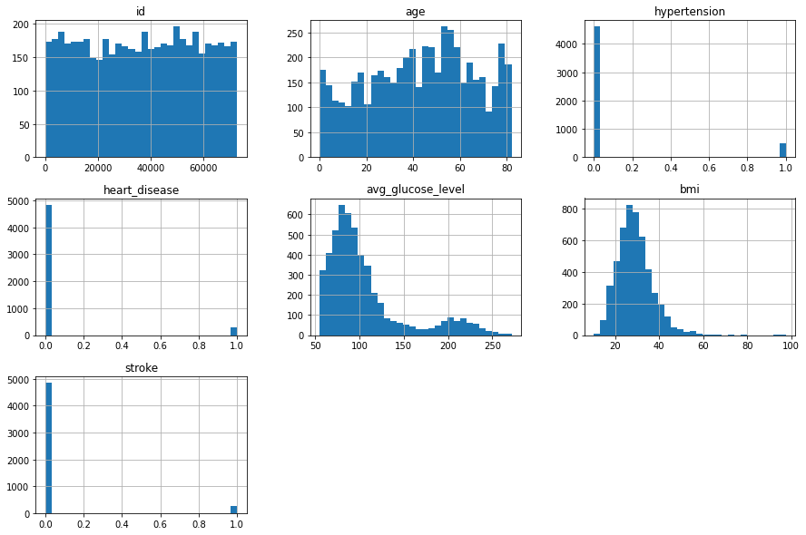

# Stroke-analysis-and-Prediction
## Table of Contents
- [Dataset](#dataset)
    - [Data Exploration](#data-Exploration)
    - [Data Cleansing](#activities)
- [Objective](#people--body)
- [Techniques](#animals--nature)
    - [Correlation](#travel--places)
    - [Logistic Regression](#activities)
    - Decision Tree
    - F1 Score
- [Conclusion](#food--drink)

- [Objects](#objects)

### Dataset

- Get the Data From [Kaggle](https://www.kaggle.com/datasets/fedesoriano/stroke-prediction-dataset)

#### Data Exploration
> df.head(5)

| | id | gender | age | hypertension | heart_disease | ever_married |	work_type | Residence_type | avg_glucose_level | bmi | smoking_status |stroke |
| - | - | - | - | - | - | - | - | - | - | - | - | - |
| 0 |	9046 |	Male |	67.0 |	0 |	1 |	Yes |	Private |	Urban |	228.69 |	36.6 |	formerly smoked |	1 |
| 1 |	51676 |	Female | 	61.0 |	0 |	0 |	Yes |	Self-employed |	Rural |	202.21 |	NaN |	never smoked |	1 |
| 2 |	31112 |	Male |	80.0 |	0 |	1 |	Yes |	Private |	Rural |	105.92 |	32.5 |	never smoked |	1 |
| 3 |	60182 |	Female |	49.0 |	0 |	0 |	Yes |	Private |	Urban |	171.23 |	34.4 |	smokes |	1 |
| 4 |	1665 |	Female |	79.0 |	1 |	0 |	Yes |	Self-employed |	Rural |	174.12 |	24.0 |	never smoked |	1 |

